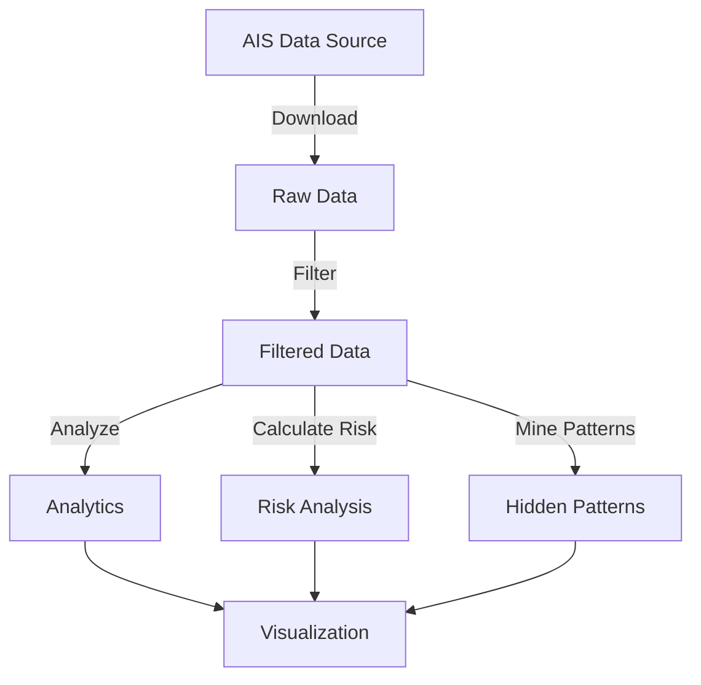

# 🚢 AIS Marine Traffic Analyzer


A web application for analyzing AIS (Automatic Identification System) data from marinecadastre.gov with advanced data mining and risk prediction capabilities.

## ✨ Features

- 📥 **Download AIS data** from marinecadastre.gov
- 🔍 **Filter data** by vessel type, geographic area
- 🗺️ **Interactive maps** with vessel positions
  - Basic map
  - Advanced map with layers
  - Direct integration with Marine Cadastre
- 📊 **Advanced analytics**
  - Correlation analysis
  - Temporal pattern detection
  - Vessel group identification
- 🚨 **Risk analysis**
  - Risk score calculation
  - Risk heatmap
  - Risky route prediction
- 🔮 **Hidden pattern mining**
  - Anomaly detection
  - Cluster analysis

## 🛠️ Architecture

```
datapy/
├── analytics.py         # Advanced analytics functions
├── api_endpoints.py     # API endpoint handlers
├── data/                # Data storage
│   └── sample_data.py   # Sample data generator
├── main.py              # Main FastAPI application
├── requirements.txt     # Dependencies
├── risk_analysis.py     # Risk analysis functions
├── run.py               # Application entry point
└── static/              # Static assets
    ├── css/             # CSS stylesheets
    └── js/              # JavaScript files
```

## 📋 Data Structure

| Category | Parameters |
|----------|------------|
| **Vessel Information** | MMSI, VesselName, VesselType, Length, Width, Draft |
| **Position Data** | LAT, LON, SOG, COG, BaseDateTime, Status, Destination |
| **Risk Analysis** | RiskScore, CollisionRisk, WeatherRisk, RouteDeviation, SpeedAnomaly, NavigationHazard |

## 🔄 Data Flow



## 📊 Risk Analysis Model

The risk analysis model calculates a comprehensive risk score based on five key factors:

- **Collision Risk** (30%): Based on vessel density in the area
- **Weather Risk** (20%): Simulated weather conditions
- **Route Deviation** (15%): Deviation from normal routes
- **Speed Anomaly** (20%): Abnormal speed detection
- **Navigation Hazard** (15%): Proximity to navigation hazards

## 🚀 Getting Started

### Prerequisites

- Python 3.8+
- pip

### Installation

1. Clone the repository:
```bash
git clone https://github.com/tranhao-wq/AIS-NOAA-Track.git
cd AIS-NOAA-Track
```

2. Install dependencies:
```bash
pip install -r requirements.txt
```

3. Run the application:
```bash
python run.py
```

4. Open your browser and navigate to:
```
http://localhost:8000
```

## 🖥️ App Screens

### AIS Marine Traffic Analyzer (Desktop)

```
+-------------------------------------------------------------+
|                AIS Marine Traffic Analyzer                  |
+-------------------------------------------------------------+
| [📂 Data Loading] [📊 Data Analysis] [🕵️‍♂️ Hidden Data] [⚠️ Risk] |
+-------------------------------------------------------------+
|                                                             |
|   (Main content area: table, charts, results, etc.)         |
|                                                             |
+-------------------------------------------------------------+
| Status bar: Ready                                           |
+-------------------------------------------------------------+
```
**Tabs:**
- 📂 Data Loading: Import CSV, sample data, data table, charts
- 📊 Data Analysis: Pattern/anomaly detection, analysis charts
- 🕵️‍♂️ Hidden Data: Mine hidden patterns, correlations
- ⚠️ Risk: Risk scores, risky routes, risk map

### SpecObj-DR17 Analyzer

```
+--------------------------------------------------------------------------------------+
|                                SpecObj-DR17 Analyzer                                |
+--------------------------------------------------------------------------------------+
| [📂 Data] [📊 Sample] [🕵️‍♂️ Hidden] [🤖 Prediction] [🧭 Direction]                      |
+--------------------------------------------------------------------------------------+
|                                                                                      |
|   (Main content area: interactive table, stats, results, charts, etc.)               |
|                                                                                      |
+--------------------------------------------------------------------------------------+
| Status bar: Ready                                                                    |
+--------------------------------------------------------------------------------------+
```
**Tabs:**
- 📂 Data: Load/process CSV, sample data, data table
- 📊 Sample: Basic stats, class distribution, correlation
- 🕵️‍♂️ Hidden: Anomaly detection, clustering, hidden patterns
- 🤖 Prediction: Train model, predict redshift/magnitude
- 🧭 Direction: Spatial/velocity/trajectory analysis

## 📸 Screenshots


## 🔒 Security

- All data is processed locally
- No external API keys required
- No sensitive information is collected

## 📄 License

This project is licensed under the MIT License - see the [LICENSE](LICENSE) file for details.